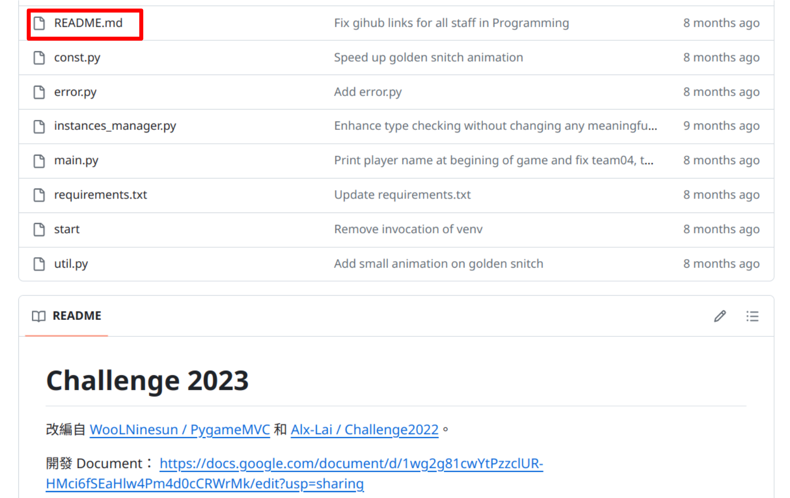
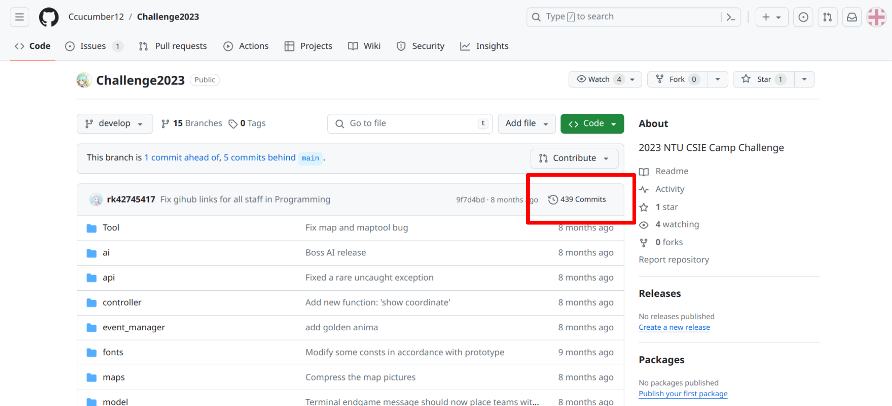

# Inspect-the-Commits
FreshmanICPC2023 - problem I

## Tips
If you ever find yourself unsure about your current progress or if things seem to be getting out of control while working with Git, a helpful strategy is to reset by either deleting the directory entirely or navigating to a different location and running the command:
```
git clone https://github.com/Shimeming/Inspect-the-Commits.git
```
This will effectively start the process anew, allowing you to regain clarity and control over your workflow.

## How to start
If python isn't installed on your computer, you can `ssh` to the workstation.
```
ssh <your_student_ID>@ws1.csie.ntu.edu.tw
```

1. Open a terminal and download the repository with the following command. It is recommended to use full screen mode.
    ```
    git clone https://github.com/Shimeming/Inspect-the-Commits.git
    ```

2. Run this command (change directory) to enter the directory.
    ```
    cd Inspect-the-Commits
    ```

3. Run this command to start.
    ```
    python3 main.py
    ```

    Run this command if the previous one doesn't work.
    ```
    python main.py
    ```

## The second key
Oops, I concealed the second key within a commit of a secret branch but I forgot where it is.

The secret is concealed in a comment in the source file of this README.
<!-- the key is: "lets join Challenge2024 together" -->

The source code of the README is in `README.md`.


You can click this button to explore commit history and inspect if there's a sus commit.



You can browse the branches by clicking this button.


You can click the "View all branches" button to see all branches.


