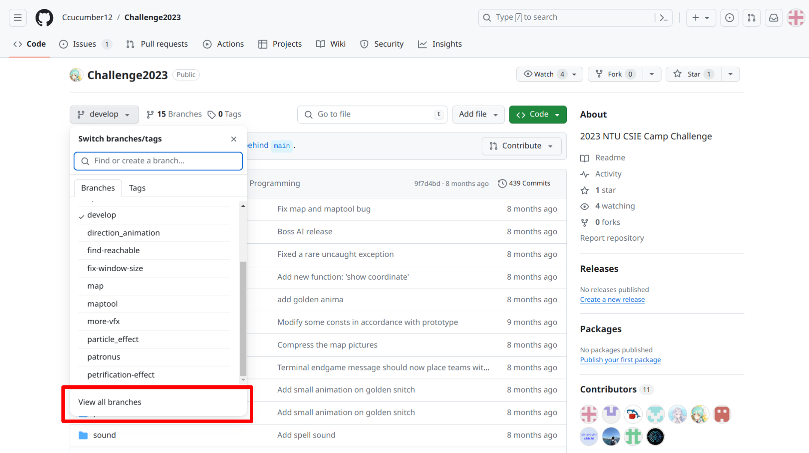

# Looking-for-Forgotten-Commit
FreshmanICPC2023 - problem L

## Tips
If you ever find yourself unsure about your current progress or if things seem to be getting out of control while working with Git, a helpful strategy is to reset by either deleting the directory entirely or navigating to a different location and running the command:
```
git clone https://github.com/Shimeming/Looking-for-Forgotten-Commit.git
```
This will effectively start the process anew, allowing you to regain clarity and control over your workflow.

## How to start
1.Open a terminal and download the repository with the following command.
```
git clone https://github.com/Shimeming/Looking-for-Forgotten-Commit.git
```

2. Run this command (change directory) to enter the directory.
```
cd Looking-for-Forgotten-Commit
```

3. Run this command to start.
```
python3 main.py
```

## The second key
Oops, I concealed the second key within a commit of a secret branch but I forgot where it is.

You can browse the branches by clicking this button.


You can click the "View all branches" button to see all branches.


